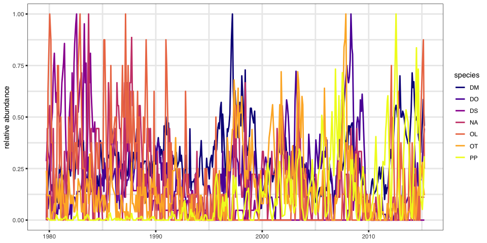
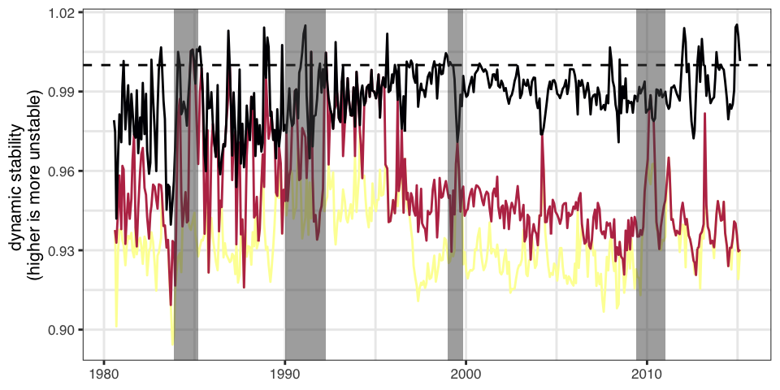
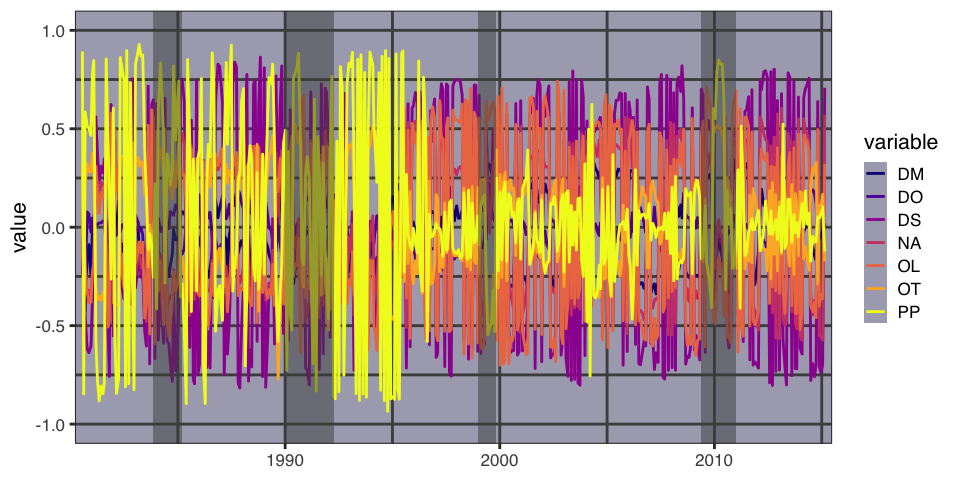
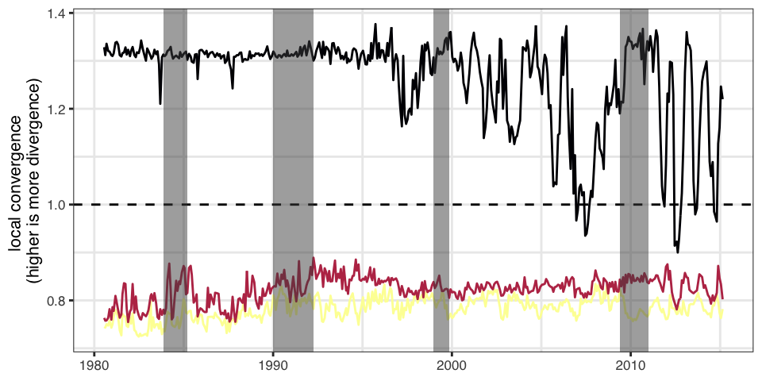
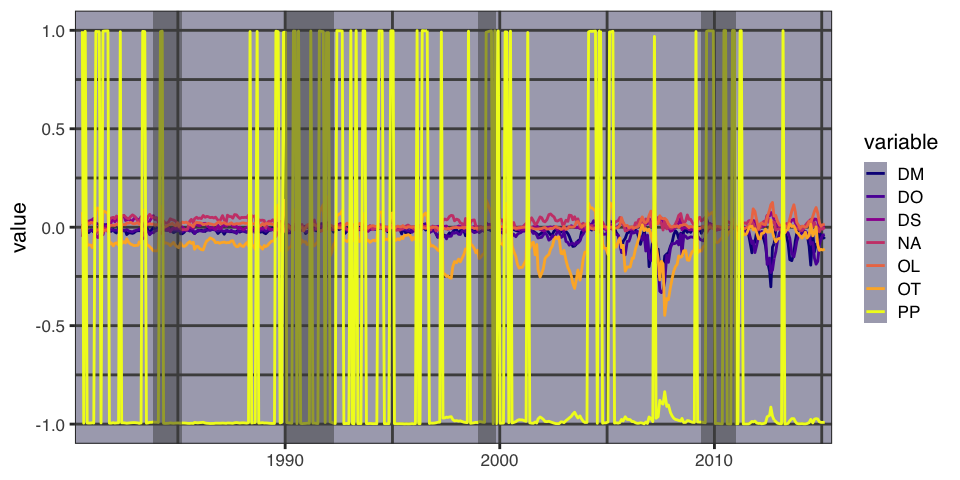
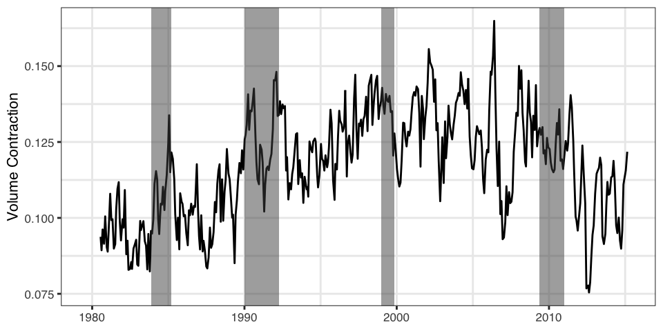
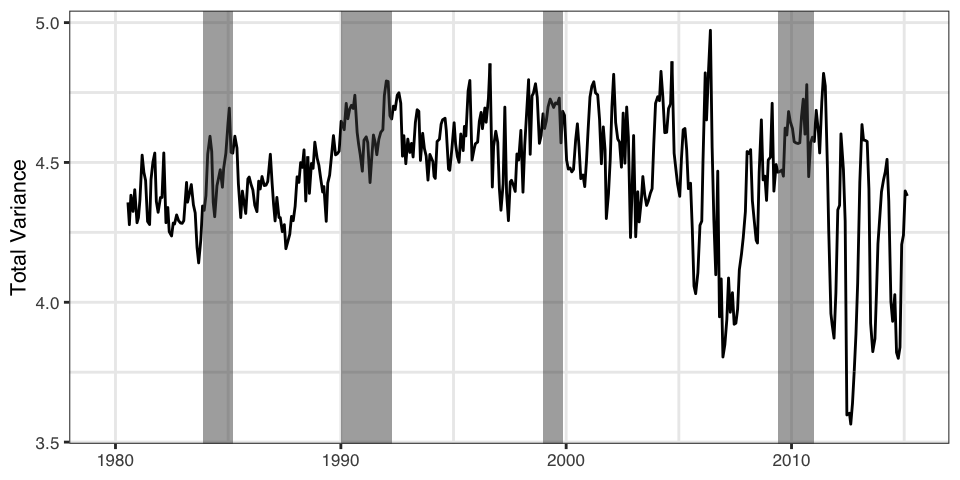
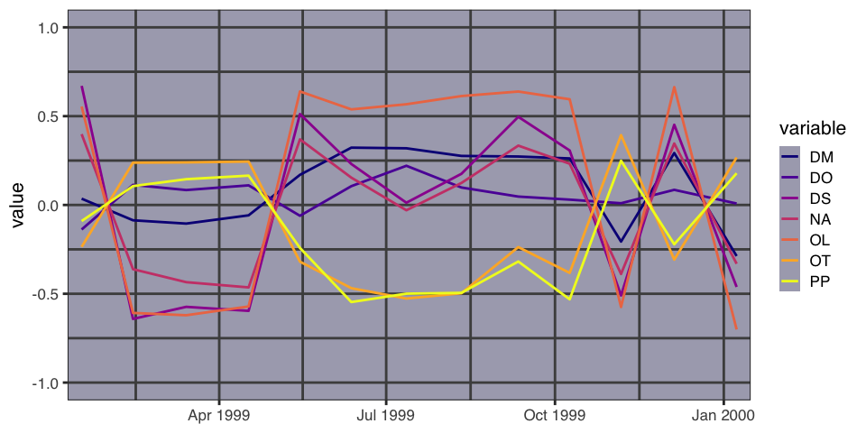
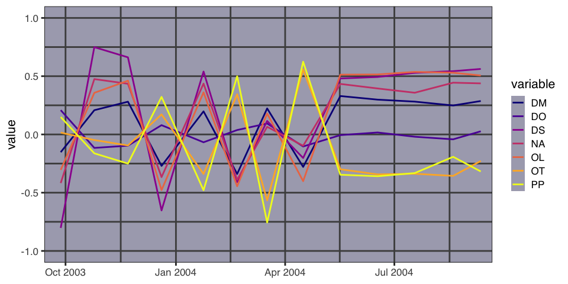
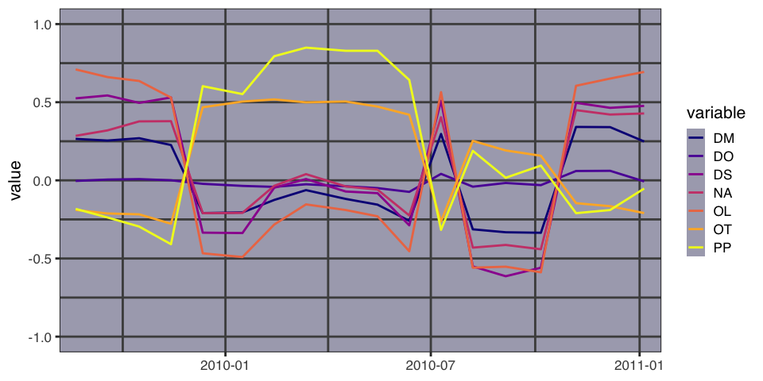

Portal Dynamic Stability Analysis
================
Hao Ye
2019-12-15

# Introduction

This report documents applying the dynamic stability analysis to the
Portal dataset (Ernest et al. 2019).

First, some setup for the environment:

``` r
library(portalDS)
library(dplyr)
library(ggplot2)

set.seed(42)
knitr::opts_chunk$set(
  fig.width = 10, 
  collapse = TRUE,
  comment = "#>"
)
```

# Workflow

## Data

We use data from the 8 control plots, up to the 2015 treatment-switch.
Abundances are summed, and scaled according to the number of plots
sampled in each census (sometimes, incomplete sampling occurred). Only
species with at least 50% non-zero abundance across the time series were
kept. Missing censuses had abundances imputed using linear interpolation
for each individual species.

``` r
block <- make_portal_block(filter_q = 0.5)
#> Loading in data version 1.132.0
str(block)
#> Classes 'tbl_df', 'tbl' and 'data.frame':    440 obs. of  8 variables:
#>  $ censusdate: Date, format: "1979-09-22" "1979-10-24" ...
#>  $ DM        : num  10 10 14 18 22 12 14 12 11 14 ...
#>  $ DO        : num  0 4 2 3.5 5 3 1 2 3 5 ...
#>  $ DS        : num  6 8 7 6.5 6 5 10 11 15 17 ...
#>  $ NA        : num  0 4 4 4.5 5 1 1 0 4 0 ...
#>  $ OL        : num  1 0 5 6.5 8 7 3 3 2 1 ...
#>  $ OT        : num  6 3 3 3 3 0 0 1 1 2 ...
#>  $ PP        : num  1 1 1 0.5 0 0 0 0 0 0 ...
```

## Analysis

We do not go through the full analysis here. Instead, see the [Maizuru
Dynamic Stability
vignette](https://ha0ye.github.io/portalDS/articles/maizuru-dynamic-stability.html)
or (eventual methdos write-up).

We specify a results file for storing the outputs of the analysis. The
`compute_dynamic_stability()` function will check for the presence of
individual output components and will skip them if they’ve already been
computed.

``` r
results_file <- here::here("output/portal_ds_results_50.RDS")
results <- compute_dynamic_stability(block, results_file, id_var = "censusdate")
str(results, max.level = 1)
#> List of 11
#>  $ block             :Classes 'tbl_df', 'tbl' and 'data.frame':  440 obs. of  8 variables:
#>  $ simplex_results   :Classes 'tbl_df', 'tbl' and 'data.frame':  7 obs. of  5 variables:
#>  $ ccm_results       :'data.frame':  88641 obs. of  9 variables:
#>  $ ccm_links         :Classes 'tbl_df', 'tbl' and 'data.frame':  35 obs. of  5 variables:
#>  $ smap_coeffs       :List of 7
#>  $ smap_matrices     :List of 440
#>  $ eigenvalues       :List of 440
#>  $ eigenvectors      :List of 440
#>  $ svd_decomp        :List of 3
#>  $ volume_contraction: Named num [1:440] NA NA NA NA NA NA NA NA NA NA ...
#>   ..- attr(*, "names")= chr [1:440] "1979-09-22" "1979-10-24" "1979-11-17" "1979-12-16" ...
#>  $ total_variance    : Named num [1:440] NA NA NA NA NA NA NA NA NA NA ...
#>   ..- attr(*, "names")= chr [1:440] "1979-09-22" "1979-10-24" "1979-11-17" "1979-12-16" ...
```

# Results

## Abundance time series

``` r
plot_time_series(results$block)
```

<!-- -->

## Eigenvalues & Eigenvectors

Highlighted segments are the posterior estimates of regime shifts from
Christensen et al. 2018.

``` r
plot_eigenvalues(results$eigenvalues, 
                 num_values = 3) %>% 
    add_regime_shift_highlight()
```

<!-- -->

``` r
plot_eigenvectors(results$eigenvectors) %>% 
    add_regime_shift_highlight()
```

<!-- -->

## Singular values and SVD vectors

Again, highlighted segments are the posterior estimates of regime shifts
from Christensen et al. 2018.

``` r
plot_svd_values(results$svd_decomp$d, 
                num_values = 3) %>% 
    add_regime_shift_highlight()
```

<!-- -->

``` r
plot_svd_vectors(results$svd_decomp$u) %>% 
    add_regime_shift_highlight()
```

<!-- -->

## Volume contraction and total variance

``` r
plot_volume_contraction(results$volume_contraction) %>%
  add_regime_shift_highlight()
#> Warning: Removed 11 rows containing missing values (geom_path).
```

<!-- -->

``` r
plot_total_variance(results$total_variance) %>%
  add_regime_shift_highlight()
#> Warning: Removed 11 rows containing missing values (geom_path).
```

<!-- -->

# Detailed Results

## Eigenvectors over specific time spans

In the second half of the time series, there are 3 periods where the
dominant eigenvalue is complex. Two of these periods also coincide with
community shifts described in Christensen et al. 2018. Here we look at
the dominant eigenvector in more detail:

``` r
lower_date <- as.Date(c("1999-01-12", "2003-09-17", "2009-08-13"))
upper_date <- as.Date(c("2000-01-12", "2004-09-17", "2011-01-15"))
```

``` r
plot_eigenvectors(results$eigenvectors) +
  scale_x_date(limits = c(lower_date[1], upper_date[1]),
               expand = c(0.01, 0))
#> Scale for 'x' is already present. Adding another scale for 'x', which
#> will replace the existing scale.
#> Warning: Removed 2912 rows containing missing values (geom_path).
```

<!-- -->

``` r
plot_eigenvectors(results$eigenvectors) +
  scale_x_date(limits = c(lower_date[2], upper_date[2]),
               expand = c(0.01, 0))
#> Scale for 'x' is already present. Adding another scale for 'x', which
#> will replace the existing scale.
#> Warning: Removed 2912 rows containing missing values (geom_path).
```

<!-- -->

``` r
plot_eigenvectors(results$eigenvectors) +
  scale_x_date(limits = c(lower_date[3], upper_date[3]),
               expand = c(0.01, 0))
#> Scale for 'x' is already present. Adding another scale for 'x', which
#> will replace the existing scale.
#> Warning: Removed 2877 rows containing missing values (geom_path).
```

<!-- -->

# References

<div id="refs" class="references">

<div id="ref-Ernest_2019">

Ernest, S. K. Morgan, Glenda M. Yenni, Ginger Allington, Ellen K.
Bledsoe, Erica M. Christensen, Renata Diaz, Keith Geluso, et al. 2019.
“Weecology/Portaldata 1.138.0.”
<https://doi.org/10.5281/zenodo.3516417>.

</div>

</div>
